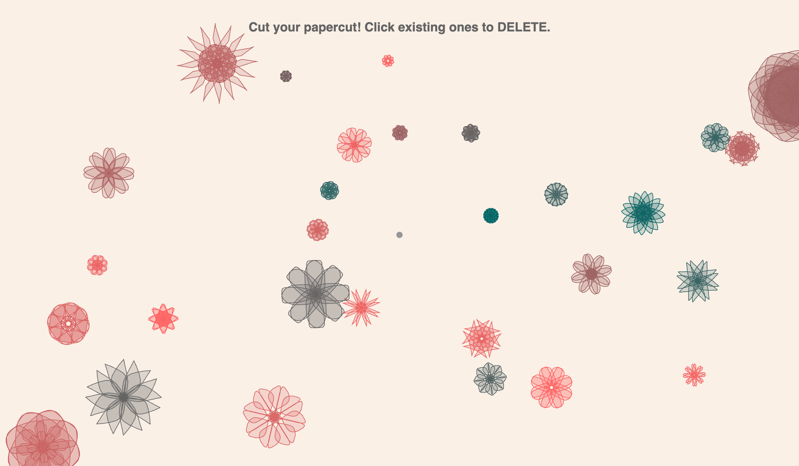

# Paper cut

**Date:** 2026.2.8
**Author:** Shiyi Ge
## Instructions
Access the project via a web browser or mobile device. Following the on-screen prompts, press and hold the mouse (or slide your finger on a mobile screen) to draw symmetrical patterns centered around the origin. 
Upon release, a unique symmetrical "window flower" (Chuang Hua) is generated. Each piece is one-of-a-kind and will automatically appear at a random position on the screen with a randomized scale.
I have implemented an "auto-close and random generation" mechanism. When the user releases the input, the system automatically completes the geometric logic to close the shape and redistributes it across the canvas. 
This design aims to simulate the traditional act of "pasting window flowers," allowing the screen to evolve into a digital folk landscape co-created by the user.
## 简介
This project is inspired by the traditional Chinese folk custom of paper-cutting. In physical art, window flowers achieve complex symmetrical beauty through intricate folding and precise cutting. In a digital context, I aim to explore "low-threshold improvised creation"—transforming a tedious, high-skill craft into intuitive, gestural brushstrokes.
## Picture

## References
- https://en.wikipedia.org/wiki/Chinese_paper_cutting
- 
